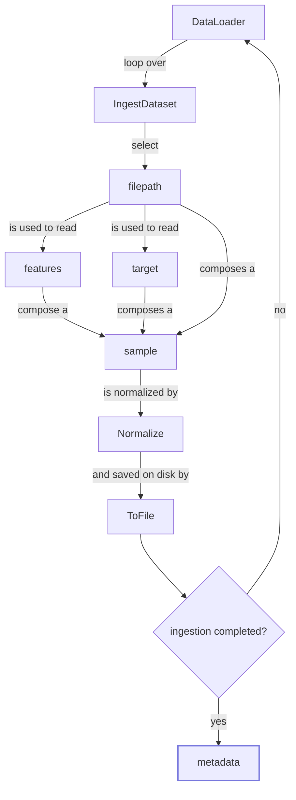

# PyTorch Template

Code and documentation template for PyTorch research projects.
This repository is intended to be cloned at the beginning of any
new research deep learning project based on PyTorch.

## Getting Started

These instructions will get you a copy of the project up and running
on your local machine for development and testing purposes.

The project folder, including also files excluded from git versioning,
has the following structure:

```
pytorch-template/                   [main folder]
│   .gitignore                      [files ignored by git]
│   .gitlab-ci.yml                  [GitLab CI/CD pipelines]
│   cli.py                          [package command-line interface]
│   LICENSE                         [code license]
│   README.md                       [this file]
│   requirements.txt                [package dependencies]
│   setup.py                        [package setup script]
│   setup.cfg                       [parameters for CI/CD]
│
├───data                            [data folder excluded from git tracking]
│   │   targets.csv                 [targets for train, dev and test data]
│   │
│   ├───train
│   │       ...
│   ├───dev
│   │       ...
│   └───test
│           ...
│
├───docs                            [documentation folder]
│       ...
│
└───pytorch_template                [package source code folder]
        ...
```

You should comply to this structure in all your projects,
in particular you should structure the `data` folder containing your dataset
according to the hierarchy shown. 

### Prerequisites

In order to run the code you need to have Python 3.6 installed.

### Installing

You can install the package on MacOS/Linux with the following commands:

```
python3.6 setup.py sdist
python3.6 setup.py bdist_wheel
pip3.6 install --no-index --find-links=dist pytorch_template -r requirements.txt
```

## Usage

A command line interface is available to easily interact with the package.

The available commands are:
- `ingest`: preprocess raw data and export it in a suitable format for model
training;
- `train`: train the deep learning model on ingested data;
- `eval`: evaluate the model on ingested validation data;
- `test`: produce model output on a single raw data sample.

### Command `ingest`

The ingestion phase is useful if preprocessing is computationally expensive and
many transformations are required. Here, for example, it is not really necessary
but it is included to show the code structure.

Optionally the `ingest` command can save some metadata about the dataset split,
like dataset global statistics computed during the full pass of the dataset,
in a pickle `.pkl` file and return the path of this file.

In some cases an additional `safe-ingest` can be used to check and assure labels 
coherence among the different dataset splits or to perform transformations
that depend on other splits. Here it is not needed because the
set of labels is not fixed since the example task is a regression.

##### Flow



### Command `train`

TODO

### Command `eval`

TODO

### Command `test`

TODO

## Performances

TODO

## Deployment

TODO 

## License

This project is licensed under Proprietary License -
see the [LICENSE](LICENSE) file for details
